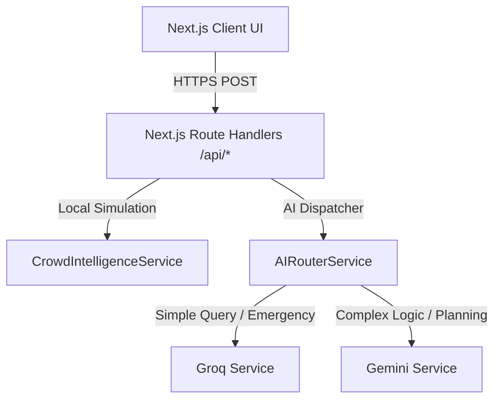

# FanFlow AI Architecture

FanFlow AI is designed as a modular, container-ready Next.js 14 Web Application built to optimize stadium logistics, transportation, and emergency assistance for the FIFA World Cup 2026.

## System Topology

## Layer Architecture

### 1. Presentation Layer (Client UI)

- **Framework**: Next.js 14 App Router.
- **State Management**: Persisted Zustand store (`app.store.ts` and `chat.store.ts`) containing stadium selection, locale state, accessibility config, and chat transcripts.
- **Animations & Skeletons**: Smooth micro-animations using Framer Motion alongside layout shift prevention via tailored tailwind skeleton components.

### 2. Controller & Routing Layer (Server API)

- **Routes**: Standard Next.js server Route Handlers (`/api/ai/*` and `/api/crowd`).
- **Security**: CSP, X-Frame headers, and Rate-Limiting middleware (`checkRateLimit`).
- **Validation**: Strict schema-based ingestion with Zod validation.

### 3. Intelligence Layer (AI Services)

- **AIRouterService**: Dual-Model router executing spatial query categorization.
- **Groq Client**: Blazing fast Llama-3.3 execution for safety-critical emergency scripts and low-latency FAQ replies.
- **Gemini Client**: Context-aware Gemini-1.5 reasoning for multi-step arrival planner, navigation routes, and transportation logic.
- **Zod Schema Force**: System prompts dictate strict JSON response objects which are validated on the server before client return.
